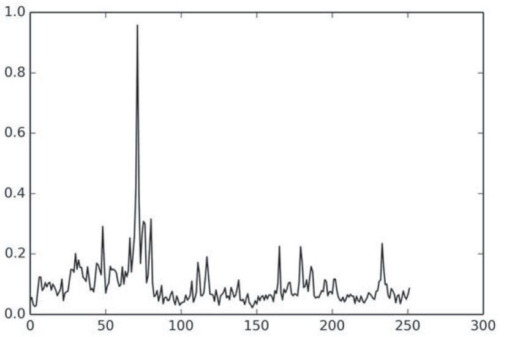

## Data Science and Complex Networks

# Financial Networks

## Introduction

Theme: discover a relationship among traded shares (equity)

. . .

look at historical market data to see whether price variations relate to each other.

Are there *regularities* that could anticipate the future behaviour of price?

. . .

In Food Networks (Ch. 1) we discovered a regularity:

$\frac{\# pred}{\# prey} \approx 1$

## Important assumption

When markets are *calm* investment becomes "mathematical"

<!-- ----------- -->
# Price time series

## Proportional return on investment

- depends on time

- essentially, the discrete derivative in $dt$ of price variation

$$
r(\Delta t) = \frac{p(t_0 + \Delta t) - p(t_0)}{p(t_0)}
$$

-----

$$
r(\Delta t) = \frac{p(t_0 - \Delta t) - p(t_0)}{p(t_0)}
$$

. . .

in the limit $\Delta t \rightarrow 0$ it can be rewritten:

$$
r(t) \simeq  \frac{d \ln{p(t)}}{dt}
$$

. . .

For discrete time:

$$
r = \ln p(t_0 + \Delta t) - \ln p(t_0)
$$

## Correlation of prices

- correlations in time series (or simply *comovements*) are valuable indicators

- Two shares are correlated if historically their price varied *in a similar way.*

- To qualify such a relation compute the correlation between their price returns over $\Delta t$.

. . .

Let $\langle r_i \rangle$ be the average return of *i* over $\Delta t$

-----

$$
\rho_{ij}(\Delta t) = \frac{\langle r_i r_j\rangle - \langle r_i\rangle \langle r_j\rangle}{\sqrt{(\langle r_i^2\rangle - \langle r_i\rangle^2 )( \langle r_j^2\rangle - \langle r_j\rangle^2)}}
$$

High $\rho$s might uncover hidden links between stocks.

Monitoring $n(n-1)$ correlations quickly becomes unfeseable: focus on high values.

<!-- -------------------------------- -->
# The Spanning tree of stocks

## Similar-behaviour shares

Correlation (or lack of it) induces a *distance* b/w shares:

$$
d_{ij}(\Delta t) = \sqrt{2(1-\rho_{ij}(\Delta t))}
$$

Let $D(\Delta t)$ be the complete matrix of pairwise distances:

it describes a complete, weighted network!

. . .

*Prune* it to create its Mimimum Spanning Tree (MST): 

drop all but n-1 *heavy* connections; maintain connectivity.

## Resulting model

The MST of 141 NYSE high-cap stocks, $\Delta t =$ 6h:30min

Some shares are "hubs" for local clusters of highly-correlated shares.

## Consequences

Network analysis helps indentifying local clusters

Each clusters will have a "hub" share

Hub shares can *signal* the beaviour of the whole cluster:

they provide leads in forecasting how sections of the market will move.
