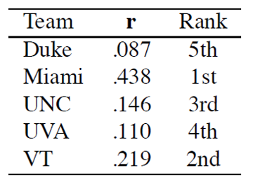
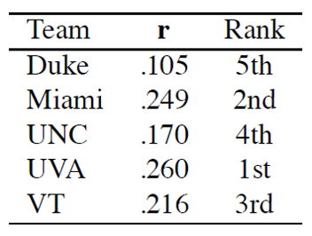
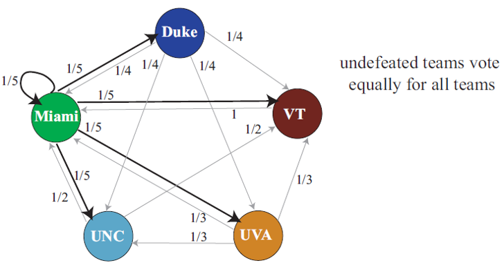
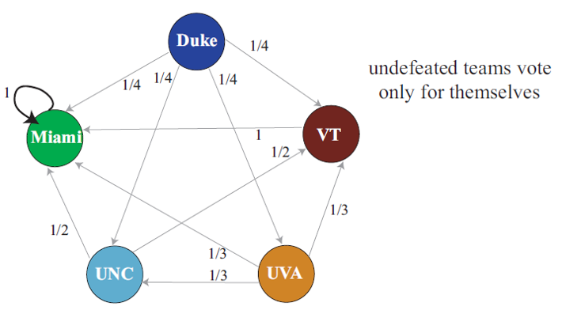
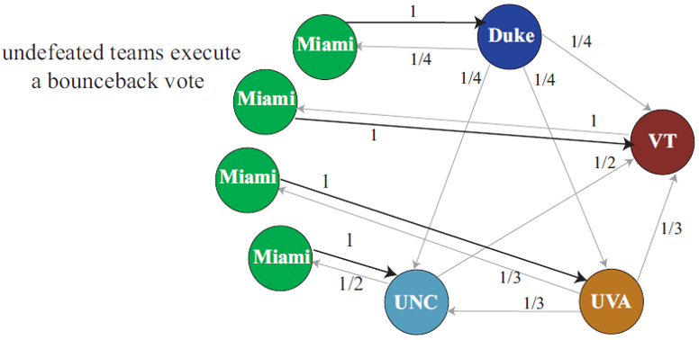
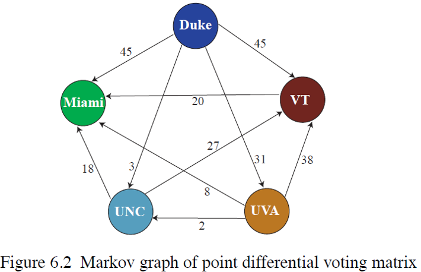
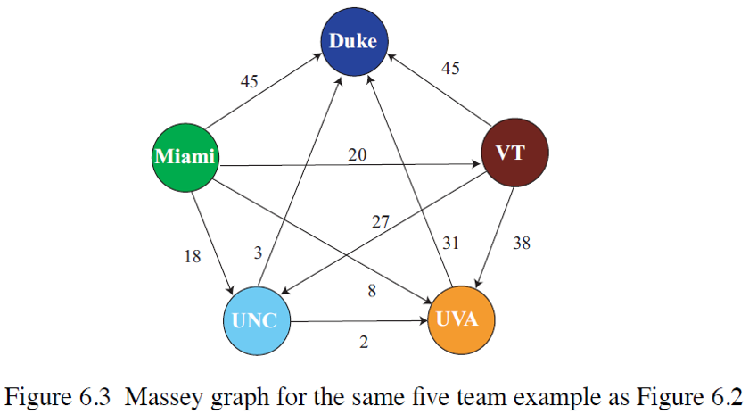

## DSTA

Ch. 6 of Langville-Meyer's textbook is dedicated to Markov chains in sport prediction

We learn a new key concept of Data Science

<!-- ---------------- -->
# Notation

## A Stochastic Matrix S

describes the probab. of a *transition* of some sort between places or states etc.

$s_{ij} = Pr[\textrm{the system goes from i to j}]$

As a result:

- each $s_{ij}$ is $\leq1$

- each row sums to 1.

-----

## Notation of the chapter

How did we obtain this matrix?

-----

Input: the win-loss data:

-----

Rows normalised to 1:

The Miami row sums to 0: not stochastic!

-----

As with PageRank, substitue all $\mathbf{0}^T$ rows with $\frac{1}{n}\mathbf{1}^T$

-----

Now the fairwheather fan takes a long, random walk along this *Markov graph:*

-----

We record the number of times the random walker passess each vertex.

After a while, the proportion of visits to each node stabiles.

. . .  

The vector $\mathbf{r}$ with the frequencies is a *stationary vector*

$\mathbf{r}$ corresponds to the dominant e-vector of the Markov-chain matrix!

<!-- ------------- -->
# How to create the Base Matrix

## With Points differential

-----

-----

## Winners/losers with points

-----

-----

## With yardage

-----

-----

-----

## With turnover

## With possession

## With linear combinations of features

$$\mathbf{S} = \alpha_1 \mathbf{S_{points}} + \alpha_2 \mathbf{S_{yard.}} + \alpha_3 \mathbf{S_{turn.}} + \alpha_4 \mathbf{S_{poss.}}$$

If weights are all non-negative and sum to 1, also $\mathbf{S}$ will be stocastic.

Weights are assigned by experts or...

could be learned by an outer ML system running on historical data.

-----

By default, let's set all 4 $\alpha$ weights to $\frac{1}{4}$:

(rating compression starts manifesting)

<!-- -------------------------- -->
# Issues at the extremes

## Handling undefeated teams

-----

A random walker soon get stuck with Miami!

-----

Assign a probability to escape:

$\mathbf{\overline{S}} = \beta \mathbf{S} + \frac{(1-\beta)}{n} \mathbf{1}$ (1 everywhere)

. . .  

PageRank: $\beta = 0.85$

NFL: $\beta = 0.6$

NCAA: $\beta = 0.5$

-----

A better example: modeling the 'Back' button of the browser when we visit a dead-end page.

<!-- -------------- -->
# Summary of the method

## The algorithm

## Comparison with Massey's

The point-differential M. chain:

-----

Massey graph for the same season

## Further applications

Let's hire fairwheater fans to do random walks:

by accumulation and stabilisation of the frequencies we will find out the dominant e-vector of $\mathbf{S}$ *without engaging in matrix operations.*

. . .

A bit of trivia:

The Mathematics genalogy project:

[Markov](https://mathgenealogy.org/id.php?id=13982) begot [Shanin](https://mathgenealogy.org/id.php?id=106671), Shanin begot [Gelfond](https://mathgenealogy.org/id.php?id=79318), Gelfond begot [me](https://mathgenealogy.org/id.php?id=74862), I begot Han and Prifti who ...
