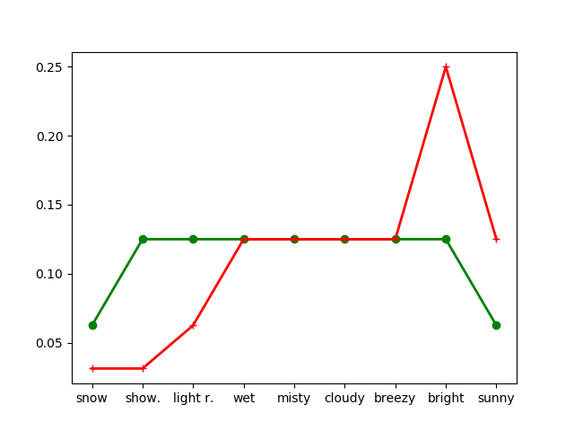

# Introduction

## A channel which sends

* reliably identical signals *brings no information:* it is deterministic and has Entropy 0.

. . .

* unpredictably diverse signals (out of n possible) is *random:* informative content is at its maximum and so is Entropy at $\log_2 n$.

. . .

All practical situations are somewhere in this spectrum.

$H[\cdot]$ is a metric on the determinism of the situation.

## Ent. as an *impurity measure*

In classification, the class assignment *is* the signal.

Consider the prob. of a signal as the frequency of such classification in the set at hand (imagine a lottery extraction from the set).

. . .

$H[\cdot]=0$ when it contains instances *from one class only.*

. . .  

$Max{H[\cdot]}=\log_2 n$ for a set which contains exactly the same amount from each possible class.

-----

When the considered set changes, e.g, because it is split into parts, Entropy changes.

*Information gain* is the decrease (hopefully) in *overall Entropy* achieved by changing the set.

Other changes/substitutions other than splitting are possible.

## [Information Loss](https://en.wikipedia.org/wiki/Lossy_compression)/Fitting

Often designed to reduce data size.

A set of real data can be substituted by a known *parametric* function:

$\hat{y} = ax + b$

$\hat{y} = a2^{\alpha x} + b$

determine a, b and $\alpha$ experimentally.

Example Criterion: min. error at the known points.

Quantify the difference wrt. the original information

<!-- ------------------------ -->
# Inf. Entropy and Divergence

## Divergence

The [Kullback-Leibler divergence](https://en.wikipedia.org/wiki/Kullback%E2%80%93Leibler_divergence) *assesses* the information loss (in Shannon's sense) we face by replacing the original distribution (P) with a candidate approximation (Q).

. . .

Let $Pr[X=x_i]=P(x_i)=P(i)$ be the prob. distribution determined by the frequence of observation.

Let Q(i) be a function which is taken as our *candidate distribution*

-----

[Letter frequencies](./imgs/letters-frequency.svg)

Let Q(i) be, e.g., $\hat{y} = \frac{1}{4}\cdot 2^{-x}+0$

-----

$$D_{KL}[P||Q] = -\sum P(i)\cdot \log_2 \frac{Q(i)}{P(i)}$$

if $Q(i)$ or $P(i)$ are 0 then we set the i-th element to 0.

. . .

Meaning: expected log-info gain/loss, counted as the number of bits, as we move from $P(\cdot )$ to $Q(\cdot )$

. . .

[wiki] A simple interpretation of the KL divergence of P from Q is the expected excess surprise from using Q as a model when the actual distribution is P.

For a simple motivating example please see [[Count Bayesie](https://www.countbayesie.com/blog/2017/5/9/kullback-leibler-divergence-explained)].

<!-- --------------------------------------------- -->
# Mastering Divergence

## London Weather, I

$X_{LDN} \in \{$ snow, showers, light rain, wet, misty, cloudy, breezy, bright, sunny}

$Pr[X_{LDN}=x_i] = [\frac{1}{16}, \frac{1}{8},\dots \frac{1}{8}, \frac{1}{16}]$

This is a simplified distribution which gives uniform probability, except for the limit conditions which are given half probability.

$H[X_{LDN}]=3.125.$

## London Weather, II

The new London wheather is more skewed towards the right side of the distribution: twice as many bright or sunny days as before.
Also, half the snow as before, a quarter of the shower days as before and half the light rain days.

$X^\prime_{LDN} \in \{$ snow, showers, light rain, wet, misty, cloudy, breezy, bright, sunny}

$Pr[X^\prime_{LDN}=x_i] = [\frac{1}{32}, \frac{1}{32}, \frac{1}{16}, \frac{1}{8}, \frac{1}{8}, \frac{1}{8}, \frac{1}{8}, \mathbf{\frac{1}{4}}, \frac{1}{8}]$

The wheather is in fact slightly more stable at $H[X^\prime_{LDN}]=2.9375.$

-----



## Re-representing London Entropy

What happens if we continue using the traditional distribution?

Let $H[X^\prime_{LDN}] = P$ be the actually-observed recent values.

Let $H[X_{LDN}] = Q$ be the reference distribution.

Shall we expect excess surprise from using Q as a model when the actual distribution is P?

Are extra bits needed to code samples from P using a coding system which was optimised for Q?

## Information divergence

divergence from P to Q:

$$D_{KL}[P||Q] = \sum P(i)\cdot \log_2 \frac{P(i)}{Q(i)}$$

dimension: Shannons (bits)

## Remember

The sample space (possible types of wheather) has to be the same.

Real data:

$P = Pr[X^\prime_{LDN}=x_i] = [\frac{1}{32}, \frac{1}{32}, \frac{1}{16}, \frac{1}{8}, \frac{1}{8}, \frac{1}{8}, \frac{1}{8}, \mathbf{\frac{1}{4}}, \frac{1}{8}]$

Traditional encoding:

$Q = Pr[X_{LDN}=x_i] = [\frac{1}{16}, \frac{1}{8}, \frac{1}{8}, \frac{1}{8}, \frac{1}{8}, \frac{1}{8}, \frac{1}{8}, \frac{1}{8}, \frac{1}{16}]$

## Computing divergence in London

$$D_{KL}[P||Q] = \sum P(i)\cdot \log_2 \frac{P(i)}{Q(i)}$$

. . .

$$D_{KL}[P||Q] = -\sum P(i)\cdot \log_2 \frac{Q(i)}{P(i)}$$

notice that for samples where there is no change, i.e., P(i)=Q(i) the information content vanishes

$$\log_2 \frac{Q(i)}{P(i)} = \log_2 1 = 0$$

and $i$ does not contribute to divergence.

-----

$-[\frac{1}{16}\cdot \log_2 \frac{\frac{1}{32}}{\frac{1}{16}} + \frac{1}{8}\cdot \log_2 \frac{\frac{1}{32}}{\frac{1}{8}} + \frac{1}{8}\cdot \log_2 \frac{\frac{1}{16}}{\frac{1}{8}} + 0 + 0 + 0 + 0$

$+ \frac{1}{8}\cdot \log_2 \frac{\frac{1}{4}}{\frac{1}{8}} + \frac{1}{16}\cdot \log_2 \frac{\frac{1}{8}}{\frac{1}{16}}]$

. . .

$= -[\frac{1}{16} \log_2 \frac{16}{32} + \frac{1}{8} \log_2 \frac{8}{32} +  \frac{1}{8} \log_2 \frac{8}{16} + \frac{1}{8} \log_2 \frac{8}{4}+ \frac{1}{16} \log_2 \frac{16}{8}]$

. . .

$= -[\frac{1}{16} \log_2 \frac{1}{2} + \frac{1}{8} \log_2 \frac{1}{4} +  \frac{1}{8} \log_2 \frac{1}{2} + \frac{1}{8} \log_2 2+ \frac{1}{16} \log_2 2]$

. . .

$= -[\frac{1}{16}\cdot -1 + \frac{1}{8} \cdot -2 +  \frac{1}{8} -1 + \frac{1}{8}\cdot 1+ \frac{1}{16} \cdot 1]$

. . .

$= -[-\frac{1}{4}]\ =\ 0.25$

Expect an extra quarter of a bit due to the old encoding.

<!-- ------------------------------- -->
# Other aspects

## Implementation

```python
from scipy.stats import entropy

ldn = [ 1/16, 1/8, 1/8, 1/8, 1/8, 1/8, 1/8, 1/8,  1/16 ]

ldn2 = [ 1/32, 1/32, 1/16, 1/8, 1/8, 1/8, 1/8, 1/4,  1/8 ]


initial_ent = scipy.stats.entropy(ldn, base=2)


div = scipy.stats.entropy(ldn, ldn2, 2)
```

## Some properties

$$
D_{KL}[P||P] = 0
$$

. . .

Nevertheless, KL is asymmetric:

$$
D_{KL}[P||Q] \neq D_{KL}[Q||P]
$$

and thus __not__ a measure in the normal sense.

## Relation with Cross-entropy

We will see Cross entropy, $H[P, Q],$ in detail in the NLP section.

$$
D_{KL}[P||Q] = H[P, Q] - H(P)
$$

Nor Cross entropy is a proper measure since $H[P, P] = H[P]$ is almost never 0.
