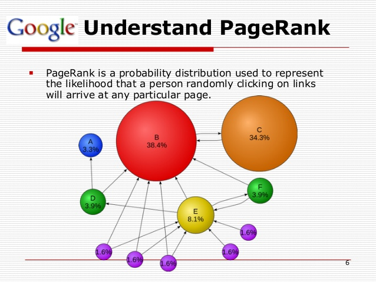

# Another equaliser lecture

## Motivations (encore)

Activity tables show how users *map* their choices or, viceversa, how available products *map* onto their adopters.

Essentially, a weighted binary relationship between users and films...

# Spectral Methods

## What is it?

When a square matrix represents relationships between entities, such as endorsement, teams defeating other teams, friends or followers on social networks etc.

several different eigenvectors can be obtained from the original matrix, giving rise to different kinds of spectral rankings

## Eigenpairs

Matrix $A$ has a real $\lambda$ and a vector $\mathbf{e}$ s.t.

$$A\mathbf{e} = \lambda \mathbf{e}$$

$\lambda$ is an *eigenvalue* and $\mathbf{e}$ an *eigenvector* of A.

. . .  

If *A* has rank *n*, then there could be up to *n* eigenpairs.
In practice,

* they might not be real, nor $\neq 0$

* are always *costly* ($\Omega(n^2)$) to find.

## Interesting square matrices

*A* is called *symmetric* when $A=A^T$

Also called *positive semidefinite* when for any __x__ we have

$$\mathbf{x}^T A \mathbf{x} \ge 0$$

In such case its eigenvalues are non-negative: $\lambda_i\ge 0$.

<!------------------------------------------------------------->
# Applications of Spectral analysis

## Spectral properties

The eigenvalues of adjacency matrices provide bounds for several graph features.
The Google PageRank algorithm *is* spectral graph analysis.

Early applications in Psychology, Social science, Bibliometrics, Economy, and Choice theory (seriously).

## Spectral ranking

Given a matrix representing preference or likeability between people, can we rank the participants (from best to worst) on the basis of their general, intrinsic likeability?

. . .

[Seely, 1949] created an index of likeability based on the ideas of *diffusion:* it is important to be liked by people who in turn are well-liked and so on.

Let $M$ be a square matrix where $m_{ij}$ represents *approval* or *endorsement* (negative values represent *disapproval)*

. . .  

my *likeability index* should be equal to the weighted sum of of the indices of the people who like me.  

-----

my *likeability index* should be equal to the weighted sum of of the indices of the people who like me.  

But their likeability is turn will depend on mine...

Let's use row vectors $\mathbf{r} = [ r_1, r_2, \dots r_n]$:

$$\mathbf{r} = \mathbf{r} M$$

i.e., $\mathbf{r}$ is a left eigenvector of M.

This formula might have no solution, but matrix preprocessing can assure one exists.

<!------------------------------------------------------------------>
# Study plan

## Background study

Ian Goodfellow, Yoshua Bengio and Aaron Courville:
[Deep Learning, MIT Press, 2016](https://www.deeplearningbook.org/).

available in HTML and PDF from the module;
it is *a refresher* of notation and properties: no examples and no exercises.
It can be read in the background of our classes.

* Phase 1: read &sect;&sect; 2.1---2.7, then &sect; 2.11.

* Phase 2: read &sect;&sect; 2.8---2.10
