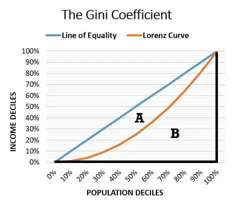

## The Gini index

## Economics studies

how quantities, e.g., income are distributed over a population.  

Could a single number express equality/inequality of a distribution?

-----

Gini axiomatised the requirements with his [G index](https://data.oecd.org/inequality/income-inequality.htm):

$G \approx 0$: all individuals have exactly the same share of wealth/income

$G \approx 1$: one individual has it all, everyone else has exacly zero

. . .

$G < 0.3$ rather egalitarian (Slovakia = 0.22)

$G > 0.4$ rather elitist wrt. income (S. Africa = 0.62)

## Compute Gini

Consider the pairwise absolute differences between individuals:

$$
G_0 = \Sigma_i \Sigma_j | x_i - x_j |
$$

. . .

normalise them for scale wrt. the overall average $\overline{x}$

-----

$$
G = \frac{\Sigma_i \Sigma_j | x_i - x_j |}{2n^2\overline{x}}
$$

Sort individuals by increasing income (X-axis) and plot cumulative income:

Gini has a straighforward *area under the diagonal* interpretation: $\frac{A}{A+b}$

## The [Gini index](https://en.wikipedia.org/wiki/Gini_coefficient) 

- is a measure of *dispersion,* not necessarily of egalitarianism

- measures a present dispersion rather than a trend.

- often implied measures are easier to observe, e.g., home computer ownership wrt. wealth.

# Applications to Data Science

## Gini impurity

In classification, __Gini impurity__ is a measure of quality for a subset of the data which is to be given a classification/label.

Algorithm: take a set of elements and choose their label by randomly selecting one element and its category.

. . .

What is the probability that this simple method leads to misclassification?

It depends on the *dispersion* in the set.

-----

Let $P(i)$ be the __normalised__ frequency distribution of *n* elements over *k* categories.

What is the prob. of misclassification, when the label is chosen randomly?

. . .

$$G = \Sigma_{i=1}^k P(i)\cdot (1 - P(i))$$

. . .

$$G = 1 - \Sigma_{i=1}^k P(i)^2$$

. . .

$G \approx 0$: all items are into one category (whatever that is): good classification likely

$G \approx 0.5$: items equally scattered over categories: bad classification likely

## Gini purity of a dimension

See [a worked-out exercise](https://sefiks.com/2018/08/27/a-step-by-step-cart-decision-tree-example/)

Dataset: playing golf today?

Day | Outlook | Temp. | Hum. | Wind | Play?
|---|---|---|---|---|---|
1 | Sunny | Hot | High | Weak | No
2 | ...

Consider three sets, on the basis of the *Outlook* dimension:

-----

where ``G(Outlook)`` is the weighted sum of the impurities of a labelling based on splitting along the values of ``Outlook`` (and the random-labelling algorithm)

Q: can we do better? E.g., Majority voting?
