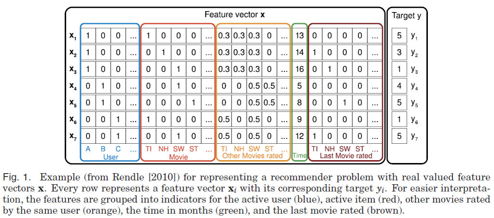
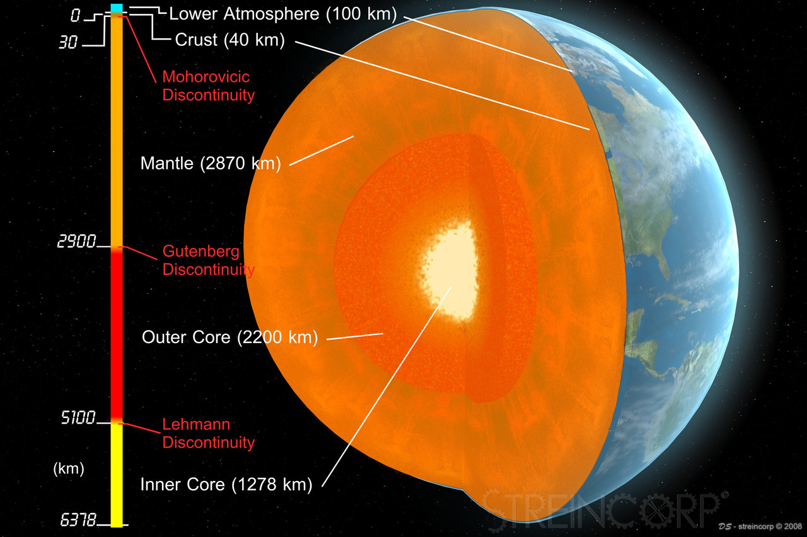
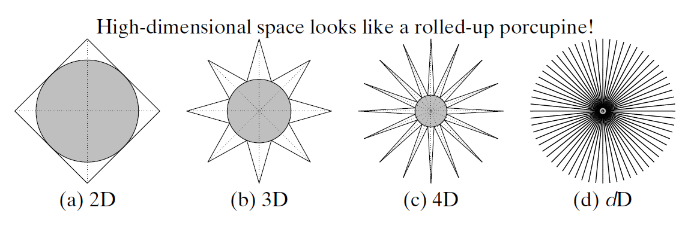

<!-------------------------------------------------------------->
# High-dimensional data

## Data Science context

- Dataset: n points in a d-dimensional space:

- essentially, a n x d matrix of floats

- For $d > 3$ and growing, several practical problems

## 1-hot encodings raise dimensionality

## How to see dimensions

<table>
	<thead>
		<th></th>
		<th>X1</th>
		<th>X2</th>
		<th>...</th>
		<th>Xd</th>		
	</thead>
	<tr>
		<td><b>x1</b></td>
		<td>x11</td>
		<td>x12</td>
		<td>...</td>
		<td>x1d</td>
	</tr>
	<tr>
		<td>...</td>
		<td>...</td>
		<td>...</td>
		<td>...</td>
		<td>...</td>
	</tr>
	<tr>
		<td><b>xn</b></td>
		<td>xn1</td>
		<td>xn2</td>
		<td>...</td>
		<td>xnd</td>
	</tr>
</table>

## Issues

- visualization is hard, we need projection. Which?

- decision-making is impaired by the need of chosing which dimensions to operate on

- __sensitivity analyis__ or causal analysis: which dimension affects others?

<!-------------------------------------------------------------->
# Issues with High-Dim. data

## I: a false sense of sparsity

adding dimensions makes points seems further apart:

<table>
	<tr>
		<th>Name</th>
		<th>Type</th>
		<th>Degrees</th>
	</tr>
	<tr>
		<td>Chianti</td>
		<td>Red</td>
		<td>12.5</td>
	</tr>
	<tr>
		<td>Grenache</td>
		<td>Rose</td>
		<td>12</td>
	</tr>	
	<tr>
		<td>Bordeaux</td>
		<td>Red</td>
		<td>12.5</td>
	</tr>
	<tr>
		<td>Cannonau</td>
		<td>Red</td>
		<td>13.5</td>
	</tr>		
</table>

d(Chianti, Bordeaux) = 0

-----

let difference b/w type count for 1 d(red, rose) = 1

take the difference in tenth-of-degree as integer: d(12, 12.5) = 5

d(Chianti, Grenache) = $\sqrt{ 1^2 + 5^2} =5.1$

. . .

Adding further dimensions make points seem further from each other

## not close anymore?

<table>
	<tr>
		<th>Name</th>
		<th>Type</th>
		<th>Degrees</th>
		<th>Grape</th>
		<th>Year</th>		
	</tr>
	<tr>
		<td>Chianti</td>
		<td>Red</td>
		<td>12.5</td>
		<td>Sangiovese</td>
		<td>2016</td>
	</tr>
	<tr>
		<td>Grenache</td>
		<td>Rose</td>
		<td>12</td>
		<td>Grenache</td>
		<td>2011</td>
	</tr>
	<tr>
		<td>Bordeaux</td>
		<td>Red</td>
		<td>12.5</td>
		<td></td>
		<td>2009</td>
	</tr>
	<tr>
		<td>Cannonau</td>
		<td>Red</td>
		<td>13.5</td>
		<td>Grenache</td>
		<td>2015</td>
	</tr>		
</table>

d(Chianti, Bordeaux) >7  

d(Chianti, Grenache) > $\sqrt{5^2 + 1^2 + 5^2} =7.14$

## II: the collapsing on the surface

- bodies have most of their mass distributed close to the surface (even under uniform density)

. . .

-----

- for d=3, $vol= \frac{4}{3}\pi r^3$.

- With 50% radius, vol. is only $\frac{1}{8}=12.5\%$

## Possibly misguiding

The most volume (and thus weight) is in the external ring (the equators)

-----

An important, counter-intuitive fact:

For a given radius, raising dimensionality *above 5* in fact [decreases the volume](https://upload.wikimedia.org/wikipedia/commons/6/6c/Hypersphere_volume_and_surface_area_graphs.svg).

-----

[The Curse of dimensionality](https://en.wikipedia.org/wiki/Curse_of_dimensionality)

Volume will concentrate near the surface: most points will look as if they are at a uniform distance from each other

- distance-based similarity fails

<!-------------------------------------------------------------->
# Consequences

## At higher dimensions

Geometry is not what we experienced in $d\leq 3.$

### counter-intuitive properties

-----

Adding dimensions migh seem to increase sparsity.

this might sound good for a clean-cut segmentation of the data

. . .

In high dimension all points tend to be at the same distance from each other

Exp: generate a set of random points in $D^n$, compute Frobenius norms: very little variance.

. . .  

bye bye clustering algorithms, e.g., K-nn.

-----

At high dimensions,

- all diagonals strangely become orthogonal to the axes
  
- points distributed along a diagonal gets *"compressed down"* to the origin of axes.

. . .

bye bye to all distance-based algorithms and similarity measures, e.g., Cosine Similarity.

<!-------------------------------------------------------------->
<!-------------------------------------------------------------->
<!-------------------------------------------------------------->
<!-------------------------------------------------------------->
<!-------------------------------------------------------------->
