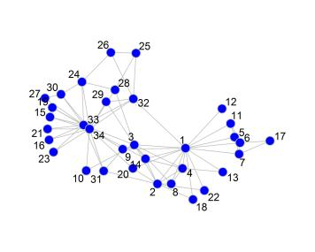
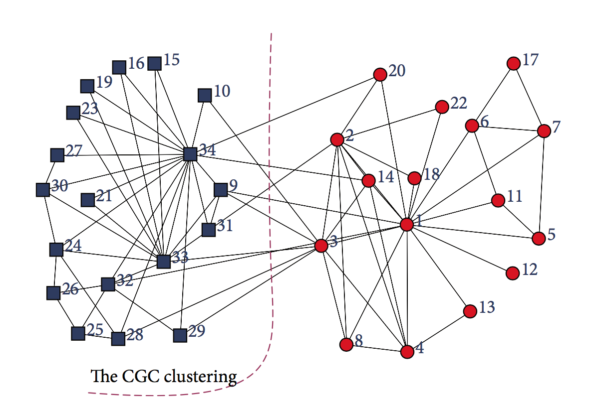
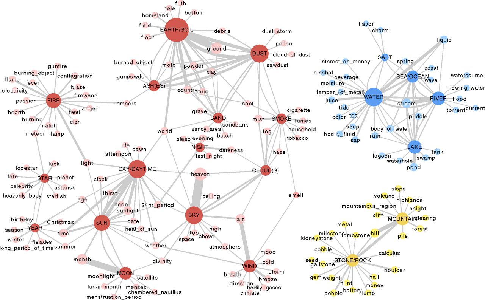
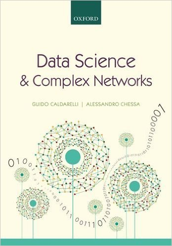
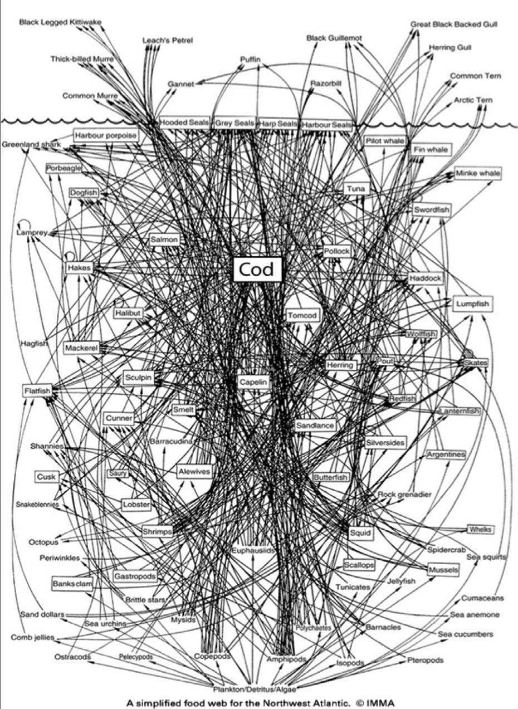

# Data Science and Complex Networks

## Basic concepts

The study of how objects(entities) connect to each other and the properties of their connection.

Possible understanding: a relationship istance.

## Terminology

- $G=\langle V, E\rangle$ where $E\subseteq V \times V$

- $|V|=n$, $|E|=m$, density is $|E|/|V|^2$

. . .

- vertex v is adjacent to u if $(u, v)\in E;$ $(v, v)\not\in E.$

- neigh. of v, N(v): the set of adjacent vertices; $deg(v)=|N(v)|$

. . .

- The adjacency matrix $A_{n\times n}$ of G: $(u,v)\in E \leftrightarrow a_{ij}=1$

. . .

- [incidence matrix $I_{n\times m}$ of G:]

<!-- $I_k^T=[0,\dots 1_u, \dots 1_v, \dots 0]$ -->

## Paths, connectedness

- A path $u\rightarrow v$ is a *sequence* of edges $\langle (u, c_1), (c_1, c_2), \dots (c_k, v)\rangle$

- its lenght (k+1) is the cardinatility of the path.

. . .

- Two vertices are connected if $\exists$ a path betw. them.

- A graph is connected if all its vertices are.

## Distances, I

- Distance is the lenght of the (possibly non-unique) shortest path connecting them, $\infty$ otherwise.

- The diameter of a graph is the maximum distance between any two pairs

## Distances, II

Average distances are also important

[Facebook, circa 2011](https://arxiv.org/abs/1111.4570v3)

> [...] the first world-scale social-network graph-distance computations, using the entire Facebook network of active users (~721 million users, ~69 billion friendship links). 
> The average distance [...] is 4.74, corresponding to 3.74 intermediaries or "degrees of separation." 

## Weighted, Directed, Multiplex

$G=\langle V, E, w\rangle$ where $w: E\rightarrow \mathbb{R}$

Path lenght: sum of the weights of the arcs.

. . .  

$G=\langle V, E\rangle$ where $v\in V$ are __nodes__ and $\langle u, v\rangle\in E$ are __arcs.__ $w: E\rightarrow \mathbb{R}$

Out-neigh. and In-neigh.

. . .

$G=\langle V, E, D\rangle$ where $V$ are __nodes__ D are __dimensions/layers__ and $\langle u, v, d\rangle\in E$ are __arcs__  

<!-- ------------------------------------ -->
# Interesting questions

## interesting questions I: paths and *oflow*

[](www.jstor.org/stable/3629752?seq=1#page_scan_tab_contents)

## interesting questions II: centralities

[](https://www.jstor.org/stable/3629752?seq=1#page_scan_tab_contents)

## interesting questions III: clustering

[](https://en.wikipedia.org/wiki/Zachary%27s_karate_club)

-----

```python
import networkx as nx

G = nx.karate_club_graph()

print("Node Degree")

for v in G:
    print('%s %s' % (v, G.degree(v)))
```

<!-- ------------------------------ -->
# Visualization

## Visualizing frequencies by graphs



## More on Graphs/Networks

[](http://book.complexnetworks.net/)
. . .

The Python 2 code can be [cloned from Github](https://github.com/datascienceandcomplexnetworks/book_code)

From the same author, a [summary of the main concepts](./caldarelli_introduction.pdf)

<!-- ------------------------------- -->
# Ch. 1: Food Webs

## Important concepts

- load data and organise it in a __networkx__ data structure

. . .

- modeling tip: it is ok to have a special node representing "nature"

- modeling tip: look for *invariants* 

. . .

- find the connected component (the __bowtie__):

source, connect and sink.

-----



## Method

- study degree distribution

- find properties of a network in terms of the *degree organization*

. . .

- study *clustering coefficient:* why is it so much better than plain network density?
