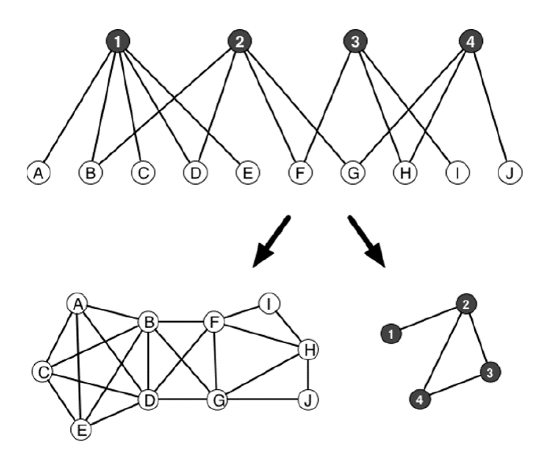
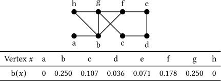

# Summary of Trade Networks

## The directed network model

Theme: discover non-trivial relationships among countries 

look at how they trade and what they trade

## Bipartite networks

The country-to-product network induces country-to-country and product-to-product relationships.



## Reconstruction

$$
C = M_{cp}\cdot M_{cp}^T
$$

$$
P = M_{cp}^T\cdot M_{cp}
$$

## Analysis of neighbours

For a node i, let $k_i$ be its degree.

For directed networks: $k_i = k_i^{in} + k_i^{out}$.

The distribution of degree $P(k)$ provides a signature of the network.

The average degree is denoted $\langle k \rangle.$

## Reciprocity

For a given directed network, reciprocity is the probability that of having links in both directions between two vertices.

R measures how the economies of two countries become interconnected (or interdependent).

$$
r = \frac{L^\leftrightarrow}{L}
$$

$L^\leftrightarrow$: number of reciprocal links

$L$: total number of links.

## Assortativity

Do vertices tend to connect with those with similar/dissimilar degree? Compute

. . .

- the avg. degree of node $i$'s neighbors:

$$
K_{nn}(i) = \frac{\sum_{\langle ij\rangle} k_j}{k_i}
$$

. . .

- Next, the avg. $K_{nn}$ for the $n_d$ nodes which have degree $d$

$$
K_{nn}(d) = \frac{\sum_{i:k_i=d} K_{nn}(i)}{n_d}
$$

-----

$$
K_{nn}(d) = \frac{\sum_{i:k_i=d} K_{nn}(i)}{n_d}
$$

Are $d$ and $K_{nn}(d)$ close?

Does assortativity grow over time?

## Balassa's RCA

Thanks to export values (entries $M_{cp}$ $in the adjacency matrix) we compute fractional ownership of export, product by product.

The Revealed Comparative Advantage (RCA) is in controlling a high fraction of some product. 

$M_{cp}$: the value of export of prod. $p$ by country $c$.

. . .

$\sum_{p^\prime} M_{cp^\prime}$: total value of export by country $c$.

. . .

$\textrm{RCA}_{cp} = \frac{\frac{M_{cp}}{\sum_{p^\prime} M_{cp^\prime}}}{\frac{\sum_{c^\prime} M_{c^\prime p}}{\sum_{c^\prime} \sum_{p^\prime} M_{c^\prime p^\prime}}}$

<!-- ------------------- -->
# The Internet Network

## The need for resolution


## From visualisation back to data

Thanks to the Beautifulsoup module, images of networks in ".svg" format can be imported into a Networkx structure.


-----

```python
from BeautifulSoup import BeautifulSoup 

FILE = 'svg-example.svg'

op = open(FILE, 'r')

xml = op.read()

soup = BeautifulSoup(xml)
```

-----

```python
G = nx.Graph()

attrs = { "line" : ["x1", "y1", "x2", "y2"] }

# what lines are there?
for attr in attrs.keys():
	tmps =  soup.findAll(attr)
```

Details in Ch. 3 of the textbook.

<!-- --------- -->
# Node Centrality

## Find important nodes

Centrality is about importance, of a vertex or edge, within the whole network.

The topology of the network should reflect such importance, so we do not need to __inspect__ the entities.

-----


## Examples


## Degree centrality

High degree leads to higher centrality

## Closeness centrality

Being in close reach to anywhere.

Let $d_{ij}$ be the distance between $i$ and $j$ on the graph.

. . .

$$
c_j = \frac{1}{\sum_{j\neq i} d_{ij}}
$$

## Harmonic centrality

Immunised against isolated vertices/disconnection

$$
c^h_j = \sum_{j\neq i} \frac{1}{d_{ij}} = \sum_{d_{ij} < \infty, j\neq i} \frac{1}{d_{ij}}
$$

## Betweenness centrality

Being in the middle/facilitating all contacts/conversations

Let $D_{jl}$ be the number of distinct paths that exist between node $j$ and node $l$.

Let also $D_{jl}(i)$ be the number of those paths that go via $i$

. . .

$$
b(i) = \sum_{\stackrel{j,l=1..n,}{i\neq j\neq l}}\frac{D_{jl}(i)}{D_{jl}}
$$

---

[](https://dl.acm.org/doi/full/10.1145/3577021)

1 shortest path in 4 (or 25%) goes through *b,* the same with *g.* 

[Brandes 2001] computes $b(i)$ in $O(|V|\cdot |E|)$: too slow to be practical even on small networks.

Estimates based on sampling are used instead.

Good estimates are valuable when the network evolves in a fully-dynamic way: edges and vertices are arbitrarily inserted/removed over time.

-----


<!-- ---------------------------- -->
# Eigenvector centrality

## A reflective definition

my c. is the average of my neighbors c.'s, 

which in turn depends on my own centrality.

. . .

The dominant e-vector $\mathbf{v_1}$ describes the direction of maximum shape-preserving expansion

$$
A \mathbf{v_1} = \lambda_1 \mathbf{v_1}
$$

-----

$$
A \mathbf{v_1} = \lambda_1 \mathbf{v_1}
$$

. . .

$$
\mathbf{v_1} = \frac{1}{\lambda_1} A \mathbf{v_1} 
$$

. . .

For each vertex $i$:

$$
v_{1_i} = \frac{1}{\lambda_1} \sum_{j}a_{ij}\cdot v_{1_j}
$$

which is the needed centrality measure.

## Computing Eigenvector centrality

1. Compute the dominant Eigenpair $(\lambda_1, \mathbf{v_1})$ of A;

2. sort vertices according to the $v_{1_i}$ value they *"scored."*
