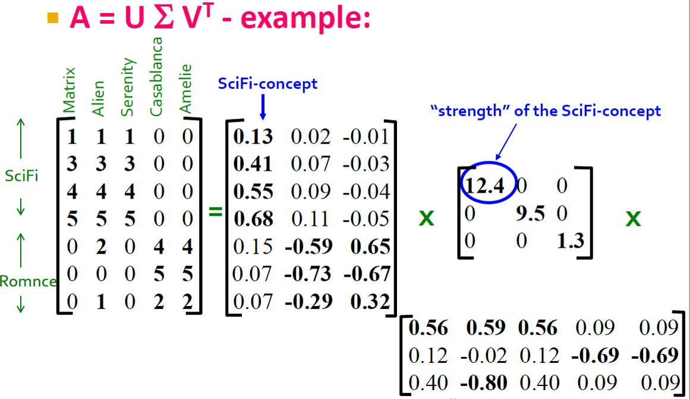
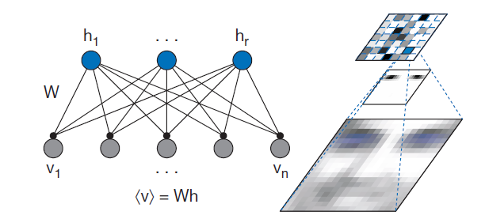
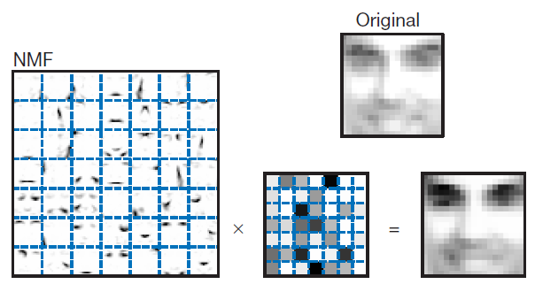
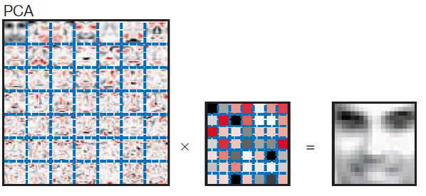
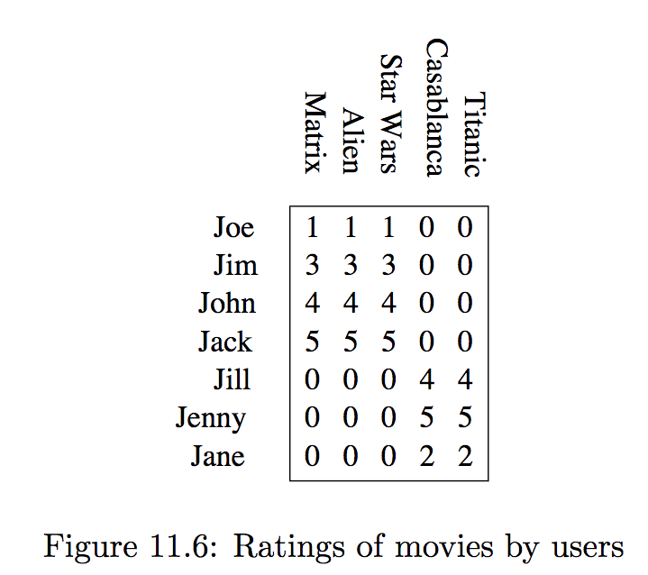

<!-- ------------------------ -->
# Review of Dim. Reduction

## With Geometry: PCA

__We outline a method not covered here:__

A n-dimensional space, populated by datapoints.

The principal component is *a* direction along which the points *best line up*

As if we were mis-measuring the dimensions: an unknown (rigid) rotation of the axes would make then minimize the points distance from the axes:  

__distance from the new axis becomes the only needed value.__

-----


-----

```python
data = [[1, 2],     
	[2, 1],
	[3, 4],
	[4, 3]]

pca(data) = [2.12, 2.12, 4.95, 4.95]
```

See [MMDS Ch. 11] for the complete numerical examples.

## With Spectral Analysis: SVD

Decompose the data matrix and interpret its 'first' eigenvalues as concepts/topics for user and activity classification:

$$M = U \Sigma V^T$$

. . .  

$U_{(m \times r)}$ is column-orthonormal: $u_i\cdot u_j^T=0$

$V^T_{(r \times n)}$ is row-orthonormal: $v_i^T\cdot v_j=0$

$\Sigma_{(r \times r)}$ is diagonal, $\sigma_{ij}$ are the singular values

dimension __*r*__ will depend on the no. of singular values found

-----

#### Conceptual hurdle: interpretation of negative values



-----

A non-negative decomposition of the activity matrix would be *interpretable:*

$$A_{(n\times d)} = P_{(n\times r)} \cdot Q_{(r\times d)}$$

* $A$: activity

* $P$: user participation to a topic

* $Q$: quantity of the topic in product

. . .

user/product profiling and reccommender sys. would be half-done already!

<!-- ------------------- -->
# Non-negative decomposition

## The numerical problem

Istance: a non-negative matrix V

Solution: non-negative matrix factors W and H s.t.

$$
V \approx W \cdot H
$$

with $w_{ij}, h_{rs}\ge 0$

## Notation

$$
A = B \cdot C
$$

Let $\mathbf{a}_i$ be the i-th column of A. It can be expressed as 

. . .

$$
\mathbf{a}_i = B \cdot \mathbf{c}_i
$$

each col. of the result is seen as a linear combination of the cols. of B, with $\mathbf{c}_i$ supplying the *weights:*

. . .

$$
\mathbf{a}_i = B \cdot \mathbf{c}_i = c_{1,i}\mathbf{b}_1 + c_{2,i}\mathbf{b}_2 + \dots + c_{n,i}\mathbf{b}_n 
$$

## Interpretation

Let $\mathbf{v}_i$ be the i-th column of V.

If V is an activity m., $\mathbf{v}_i$ represent the *consumption* of $i$

. . .

$$
v_i \approx W\cdot h_i
$$

Consumption of i is given by a linear combination of the cols. of W, with $h_i$ supplying the weights.

Each $\mathbf{w}_i$ is interpretable as a pattern (or mask)

-----

[[Lee & Seung, Nature, 1999]](http://www.nature.com/nature/journal/v401/n6755/abs/401788a0.html): "Learning the parts of objects by non-negative matrix factorization."

$$
\mathbf{v}_i \approx \mathbf{w}_1 \cdot h_{1,i} + \dots \mathbf{w}_r \cdot h_{1,r}
$$

> W can be regarded as containing a basis that is optimized for the linear approximation of the data in V.  

. . .

> Since relatively few basis vectors are used to represent many data vectors, good approximation can only be achieved if the basis vectors discover structure that is latent in the data.

## NMF as error-minimization

Notation: $||X - Y||^2 = \sum_{i,j}(x_{ij} - y_{ij})^2$

. . .

__Input:__ $V_{n\times m}$

__Minimize__ $||V -  WH||^2$

__subject to__ $W,H \ge 0$.

. . .

- choose the new dimension *r* s.t. $(n+m)r < nm$;

- calculate $W_{n\times r}$ and $H_{r\times m}$.

## Information-theoretic view  

If the input matrix can be (somehow) normalised then we see the search for the perfect non-negative decomposition in terms of minimizing *divergence:*

$D_I(X||Y) =  \Sigma_{i,j} (x_{ij}\cdot \log(\frac{x_{ij}}{y_{ij}}) - x_{ij} + y_{ij}))$

. . .  

__Minimize__  $D_I(V || W H)$  

__subject to__  $W,H \ge 0$.

Recommended for sparse counting data.

The standard $D_{KL}$ can also be used.

## Gradient descent KO

> Although [error func.] are convex in W only or H only, they are not convex in both variables together.
>
> Therefore it is unrealistic to expect an algorithm to solve [the problem] in the sense of finding global minima.  

-----

> However, there are many techniques from numerical optimization for finding local minima.  
> 
> Gradient descent is  perhaps the simplest technique to implement, but convergence can be slow.  

<!-- ----------------------- -->
# Lee-Seung's Method

## Iterated __error balancing__

1. start from random W and H

2. compute the error

3. update W and H with the __multiplicative update__

. . .


-----

Gradient descent: we *move around* by adding/subtracting some quantity

NMF: *moves around* by multiplying by a *local* error measure

$\frac{v_{i\mu}}{(wh)_{i\mu}}$

. . .


-----


* through iteration, the $\frac{v_{i\mu}}{(wh)_{i\mu}}$ factors vanish and we stop.

* the update rules maintain non-negativity and force $\mathbf{w}_i$ to sum to 1.

<!-- ------------------- -->
# Interpretability of NMF

## The 19x19 mugshots


-----

A probabilistic hidden-variables model:



Cols. of W are *bases* that are combined to form the rec.

The influence of $\mathbf{h}_a$ on $\mathbf{v}_i$ is represented by a connection __of strength__ $w_{ia}$

-----


(W and H are shown in a 7x7 montage)

-----

The *eigenfaces* might have negative values



<!-- ---------------------- -->
# Activity-matrix decomposition

## A simple ratings matrix



-----

N=7, M=5.

Fix K=2 and run NMF:

```python
@INPUT:
    R: a m. to be factorized, dim. N x M
    P: an initial m. of dim. N x K
    Q: an initial m. of dim. M x K
    K: the no. of latent features
    steps: the max no. of steps to perform the optimisation
    alpha: the learning rate
    beta: the regularization parameter

@OUTPUT:
    the final matrices P and Q
```

## Direct implementation (1 run)

```python
nP=
[[ 0.33104196  0.39332058]
 [ 1.08079793  1.08397306]
 [ 1.59267325  1.27929568]
 [ 1.87852789  1.72209575]
 [ 0.67146598  1.76523621]
 [ 1.04872774  2.10824903]
 [ 0.94419145  0.59698619]]
```

```python
nQ.T=
[[ 1.27381876  1.3870236   1.67315614  0.9855609   0.81578369]
 [ 1.50953822  1.38352352  1.06501557  1.87281749  1.96189735]]
```

## Analysis of the error, I

```python
np.dot(nP, nQ.T) = [[ 1.01541991  1.00333129  0.97277743  1.06287968  1.04171324]
		[ 3.01303945  2.99879446  2.96279189  3.09527589  3.0083412 ]
		[ 3.95992279  3.97901104  4.02726085  3.9655638   3.80912366]
		[ 4.99247343  4.98812249  4.97712927  5.07657468  4.91104751]
		[ 3.52001748  3.37358497  3.00347147  3.96773585  4.01098322]
		[ 4.51837154  4.37142223  4.00000329  4.98195069  4.99170315]
		[ 2.10390225  2.13556026  2.21557931  2.04860435  1.94148161]]
```

```python
ratings =  [[1, 1, 1, 0, 0],
            [3, 3, 3, 0, 0],
            [4, 4, 4, 0, 0],
            [5, 5, 5, 0, 0],
            [0, 0, 0, 4, 4],
            [0, 0, 0, 5, 5],
            [0, 0, 0, 2, 2]]
```

## Analysis of the error, II

```python
np.rint(np(nP, nQ.T))= [[ 1.  1.  1.  1.  1.]
			[ 3.  3.  3.  3.  3.]
			[ 4.  4.  4.  4.  4.]
			[ 5.  5.  5.  5.  5.]
			[ 4.  4.  4.  4.  4.]
			[ 5.  5.  5.  5.  5.]
			[ 2.  2.  2.  2.  2.]]
```

```python
ratings =  [[1, 1, 1, 0, 0],
            [3, 3, 3, 0, 0],
            [4, 4, 4, 0, 0],
            [5, 5, 5, 0, 0],
            [0, 0, 0, 4, 4],
            [0, 0, 0, 5, 5],
            [0, 0, 0, 2, 2]]
```

try [Scikit-learn](http://scikit-learn.org/stable/modules/generated/sklearn.decomposition.NMF.html) on [the same instance](./src/scikit-learn-nmf.py)

## Analysis of the result

```python
W(user x topic) = [[ 0.          0.82037571]
    [ 0.          2.46112713]
    [ 0.          3.28150284]
    [ 0.          4.10187855]
    [ 1.62445593  0.        ]
    [ 2.03056992  0.        ]
    [ 0.81222797  0.        ]]
```

```python
H(topic x film) =
[[ 0.          0.          0.          2.46236289  2.46236289]
 [ 1.21895369  1.21895369  1.21895369  0.          0.        ]]
```

. . .  

W: users' committment to a topic.

H: films' pertinence to a specific topic (binary, why?)
